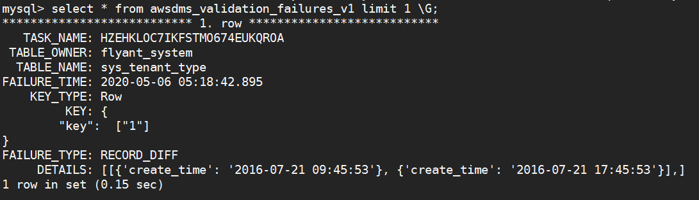

# aws 操作

### 环境确定

- 1 源mysql 10.13.128.248; 目标 aws Aurora
- 2 确定mysql版本   
          
   

- 3 创建aws rds 实例  
  `注意修改时区 通过修改配置文件 `

### 迁移架构

   

### endpoint建立
 依次建立endpoint --即源端数据库和目的数据库
 

 

**这里我用haproxy转发了内网的mysql端口**

### 创建复制实例

  
  
  **注意开启公开访问**
  
  
### 测试连接状况

   测试复制节点与endpoint的连接状况
   
   
   
  

### 创建迁移任务
   
   开启cloudwatch和验证 开启cloudwatch需要创建一个role [文档](https://aws.amazon.com/cn/premiumsupport/knowledge-center/dms-cloudwatch-logs-not-appearing/)   
   通过高级任务设置限制并发数以及控制同步的表
   一个复制实例可以承担多个复制任务
   
### 数据验证
   验证失败的问题 可以在awsdms_validation_failures_v1表里面查看问题
   
   这里验证任务处理时间戳(timestamp类型)的时区不一致 所以不匹配 但是数据是一致的 

   
   
   
   

    

